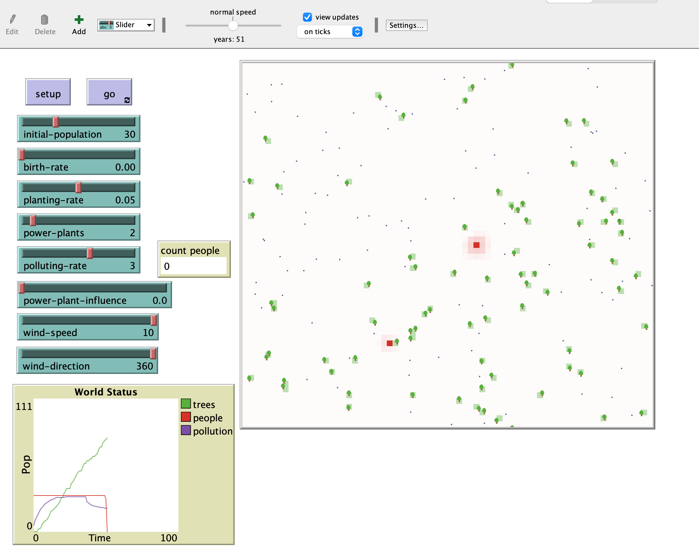

## Комп'ютерні системи імітаційного моделювання
## СПм-22-3, **Привалов Богдан Вікторович**
### Лабораторна робота №**2**. Редагування імітаційних моделей у середовищі NetLogo

 

### Варіант 4, модель у середовищі NetLogo:
[Urban Suite - Pollution](http://www.netlogoweb.org/launch#http://www.netlogoweb.org/assets/modelslib/Curricular%20Models/Urban%20Suite/Urban%20Suite%20-%20Pollution.nlogo)

 

### Внесені зміни у вихідну логіку моделі, за варіантом:

**Реалізовано позитивний вплив наявності електростанцій на вірогідність появи нових людей. Додано нову змінну 'power-plant-influence' у властивостях клітин, яка збільшує ймовірність народження нових людей:**

<pre>
patches-own [
  power-plant-influence
]
</pre>
Змінюємо вірогідність висадки дерев у клітинах поблизу електростанцій:
<pre>
to maybe-plant  ;; person procedure
  if random-float 1 < planting-rate + power-plant-influence [
    hatch-trees 1 [
      set health 5
      set color green
    ]
  ]
end
</pre>
Реалізуємо позитивний вплив наявності електростанцій на вірогідність появи нових людей:
<pre>
to reproduce  ;; person procedure
  if health > 4 and random-float 1 < birth-rate + power-plant-influence [
    hatch-people 1 [
      set health 5
    ]
  ]
end
</pre>

Додана властивість power-plant-influence для клітин, щоб відслідковувати вплив електростанцій на них. Електростанції тепер впливають на сусідні клітинах, збільшуючи вірогідність висадки дерев та народження нових людей.

### Внесені зміни у вихідну логіку моделі, на власний розсуд:
Додано новий атрибут клітин clean-energy для відображення наявності чистої енергії і її впливу на народжуваність.

<pre>
patches-own [
  clean-energy
]
</pre>
Додано новий метод для симуляції ефекту чистої енергії на народжуваність:
<pre>
to update-clean-energy-effect
  ask patches with [clean-energy > 0] [
    ask neighbors [
      set birth-rate birth-rate + (clean-energy * 0.001)
    ]
  ]
end
</pre>
Велючено новий метод до головного циклу моделі:
<pre>
to go
  update-clean-energy-effect
end
</pre>
Експеримент демонструє, що чиста енергія може мати позитивний вплив на демографічні показники в симульованому середовищі. Це відкриває можливості для додаткових досліджень щодо взаємозв'язку між екологічними умовами та демографічною динамікою, а також розробки стратегій збільшення народжуваності через покращення екологічних умов.

Фінальний код моделі та її інтерфейс доступні за [посиланням](model.nlogo). *// якщо вносили зміни до інтерфейсу середовища моделювання - то експорт потрібен у форматі nlogo, як тут. Інакше, якщо змінювався лише код логіки моделі, достатньо викласти лише його, як [тут](model-code.html),якщо експортовано з десктопної версії NetLogo, або окремим текстовим файлом, шляхом копіпасту з веб-версії*.
 

