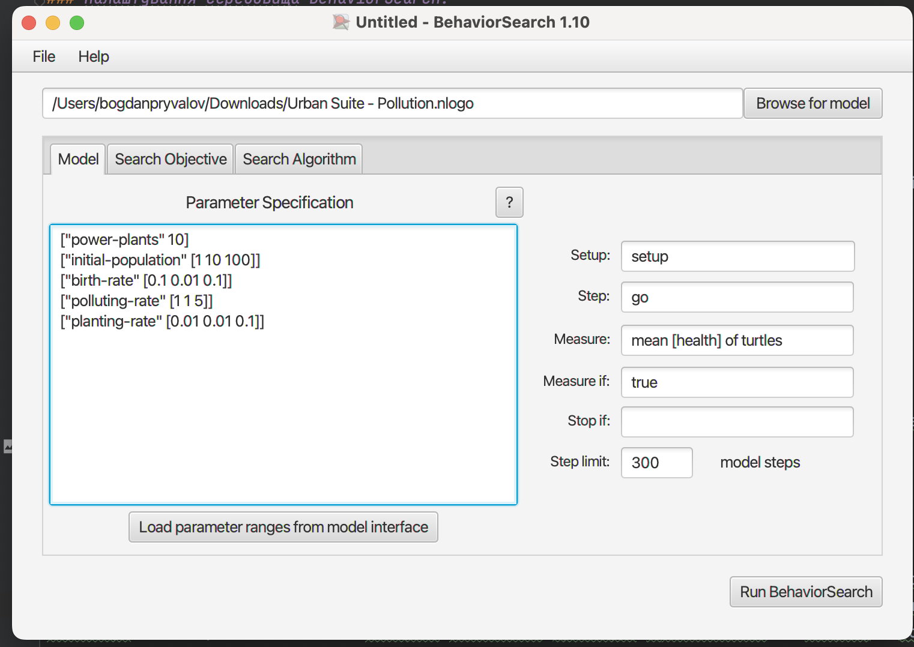
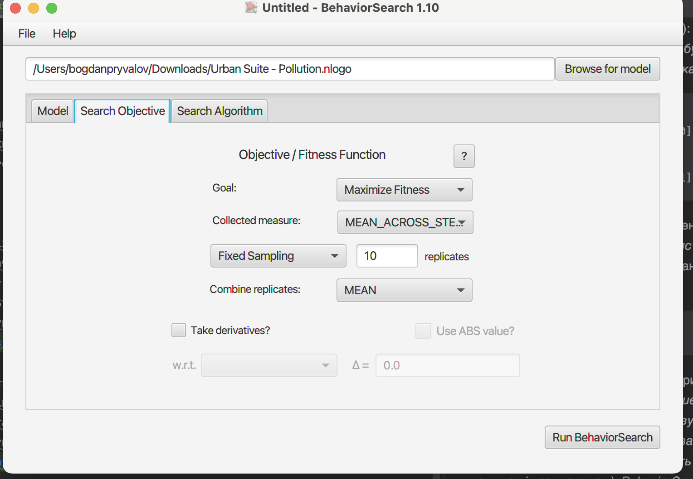
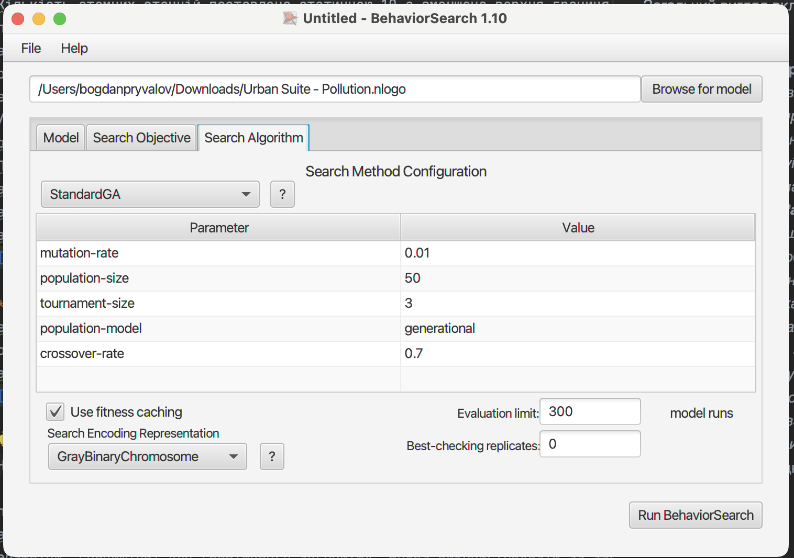
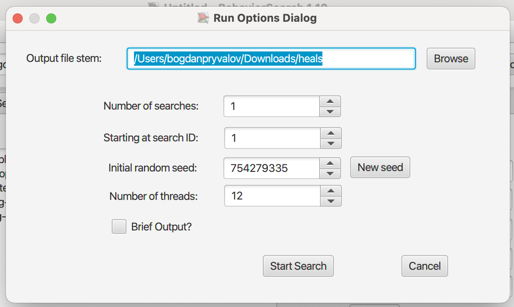
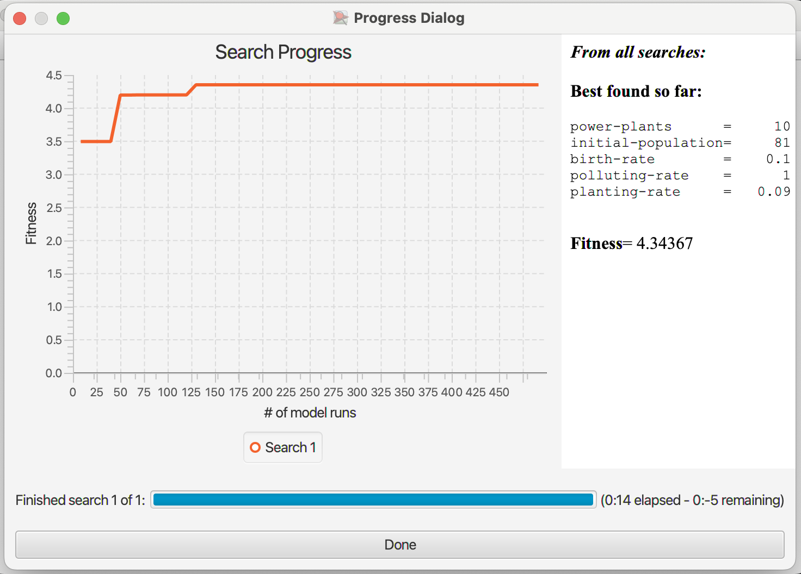
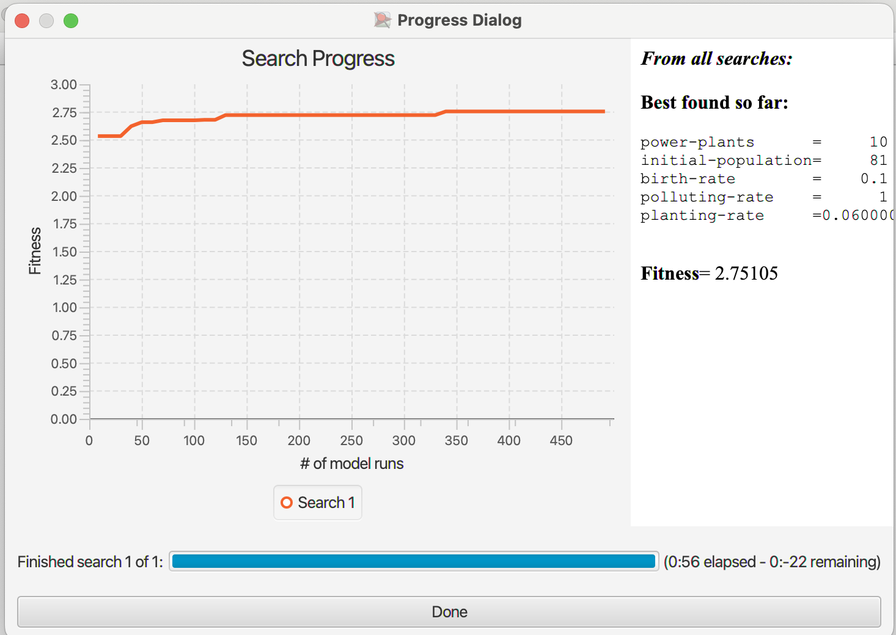
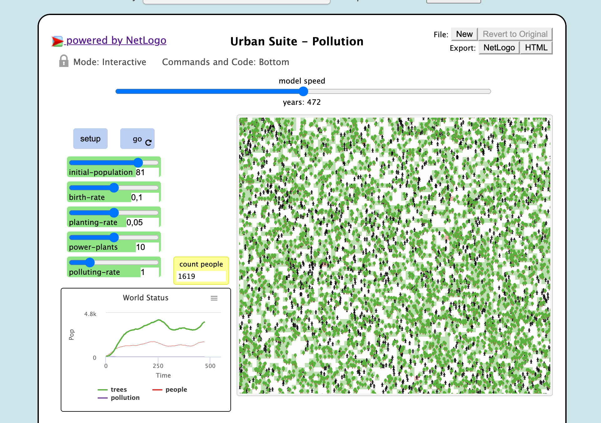

## Комп'ютерні системи імітаційного моделювання
## СПм-22-3, **Привалов Богдан Вікторович**
### Лабораторна робота №**3**. Використання засобів обчислювального интелекту для оптимізації імітаційних моделей

 

### Варіант 4, модель у середовищі NetLogo:
[Urban Suite - Pollution](http://www.netlogoweb.org/launch#http://www.netlogoweb.org/assets/modelslib/Curricular%20Models/Urban%20Suite/Urban%20Suite%20-%20Pollution.nlogo). Забруднення повітря та боротьба з ним.
 

### Вербальний опис моделі:
Симуляція забруднення повітря є дослідженням екосистеми хижак-жертва. Моделювання популяції людей, дерев та електростанцій в замкнутому середовищі. Використовуючи цю модель, можна досліджувати поведінку популяцій протягом тривалого часу, коли вони динамічно взаємодіють: хижаків (забруднення) і здобич (людей) можна порівнювати протягом кількох поколінь, оскільки їхні популяції демонструють регулярний або нерегулярний репродуктивний успіх.
### Керуючі параметри:
- **initial-population** визначає початкову кількість населення.
- **birth-rate** рівень нарожуваності, який визначає скільки людей народжується щорічно.
- **planting-rate** рівень посадки дерев, який визначає скільки дерев висаджено щорічно.
- **power-plants** кількість електростанцій.
- **polluting-rate** рівень забрудненості, який генерується внаслідок діяльності електростанцій.

### Внутрішні параметри:
- **people** кількість населення, яка впливає на споживання ресурсів та викиди забруднюючих речовин.
- **trees** кількість дерев в місті, які впливають на зменшення рівня забруднення повітря через поглинання забруднюючих речовин.
- **pollution** рівень забруднення повітря, який визначається сумою всіх джерел забруднення в місті.

### Показники роботи системи:
- Рівень забруднення повітря - відображає поточний рівень забруднення повітря.
- Кількість дерев - відображає поточну дерев в місті, які сприяють зменшенню забруднення.
- Кількість населення - відображає поточну кількість мешканців міста, які впливають на споживання ресурсів та викиди забруднюючих речовин.

 

### Налаштування середовища BehaviorSearch:

**Обрана модель**:
<pre>
/Users/bogdanpryvalov/Downloads/Urban Suite - Pollution.nlogo
</pre>
**Параметри моделі** (вкладка Model):  
*Параметри та їх модливі діапазони були **автоматично** вилучені середовищем BehaviorSearch із вибраної імітаційної моделі, для цього є кнопка «Завантажити діапазони параметрів із інтерфейсу моделі»*:
<pre>
["power-plants" 10]
["initial-population" [1 10 100]]
["birth-rate" [0.1 0.01 0.1]]
["polluting-rate" [1 1 5]]
["planting-rate" [0.01 0.01 0.1]]
</pre>
*Кількість атомних станцій поставлена статичною 10 а зменшена верхня границя народжуваності.
Для фітнес-функції *(вона ж функція пристосованості або цільова функція)* було обрано **здоров'я людей**, вираз для її розрахунку взято з налаштувань графіка аналізованої імітаційної моделі в середовищі NetLogo
та вказано у параметрі "**Measure**":
<pre>
mean [ health ] of turtles
</pre>
Здоров'я за весь період симуляції тривалістю, *для приклада*, 300 тактів починаючи з 0 такту симуляції.  
*Параметр "**Mesure if**" зі значення true, по суті, і означає, що враховуватимуться всі такти симуляції, а чи не частина їх. Іноді має сенс не враховувати деякі такти через хаос в деяких моделях на початку їх використання. Наприклад, це показано в прикладі з документації BehaviorSearch.  
Параметри "**Setup**" та "**Go**" вказують відповідні процедури ініціалізації та запуску в логіці моделі (зазвичай вони так і називаються). BehaviorSearch в процесі роботи, по суті, замість користувача запускає ці процедури.*  
Параметр зупинки за умовою ("**Stop if**") у разі не використовувався.  
Загальний вигляд вкладки налаштувань параметрів моделі:  

**Налаштування цільової функції** (вкладка Search Objective):  
Метою підбору параметрів імітаційної моделі, є **максимізація** значення здоров'я – це вказано через параметр "**Goal**" зі значенням **Maximize Fitness**. Нас цікавить середнє значення здров'я за всю симуляцію (тривалість якої (300 кроків) вказувалася на минулій вкладці). Для цього у параметрі "**Collected measure**", що визначає спосіб обліку значень обраного показника, вказано **MEAN_ACROSS_STEPS**.  
Щоб уникнути викривлення результатів через випадкові значення, що використовуються в логіці самої імітаційної моделі, **кожна симуляція повторюється по 10 разів**, результуюче значення розраховується як **середнє арифметичне**. *Якщо вважаєте вплив випадковості на те, що відбувається в обраній вами імітаційній моделі незначним - то повторні симуляції можуть бути і не потрібні.*  
Загальний вигляд вкладки налаштувань цільової функції:  

**Налаштування алгоритму пошуку** (вкладка Search Algorithm):  
*На цьому етапі було визначено модель, налаштовано її параметри (тобто вказано, які з них незмінні, а які в процесі пошуку можуть змінюватися і в яких діапазонах), і обрано міру, що лежить в основі функції пристосованості, що дозволяє оцінити якість кожного перевіряємого BehaviorSearch варіантів рішення.  
У ході дослідження на лабораторній роботі використовуються два алгоритми: Випадковий пошук(**RandomSearch**) і Простий генетичний алгоритм (**StandardGA**).  
Для цих алгоритмів, що вирішують завдання пошуку такого набору параметрів імітаційної моделі, щоб задовольнити вимоги користувача (у нашому випадку – максимізувати значення середньої швидкості переміщення агентів у заданій імітаційній моделі), необхідно вказати "**Evaluation limit**" (число ітерацій пошуку, у разі ГА – це буде кількість поколінь), та "**Search Space Encoding Representation**" (спосіб кодування варіанта вирішення). Загальноприйнятого "кращого" способу кодування немає, треба куштувати, які підійдуть саме до вашої моделі.
Параметр "**Use fitness caching**" впливає лише на продуктивність.
Параметри, специфічні для генетичного алгоритму, можна використовувати за замовчанням, якщо це не завадить отримати результат. На захисті їх, звичайно, обговоримо.*  
Загальний вид вкладки налаштувань алгоритму пошуку:  

 

### Результати використання BehaviorSearch:
Діалогове вікно запуску пошуку *(можна залишити за замовчуванням, але стежте, куди пишеться результат)*:  

Результат пошуку параметрів імітаційної моделі, використовуючи **генетичний алгоритм**:  

Результат пошуку параметрів імітаційної моделі, використовуючи **випадковий пошук**:  

Результат півстановки отриманих результатів:  
