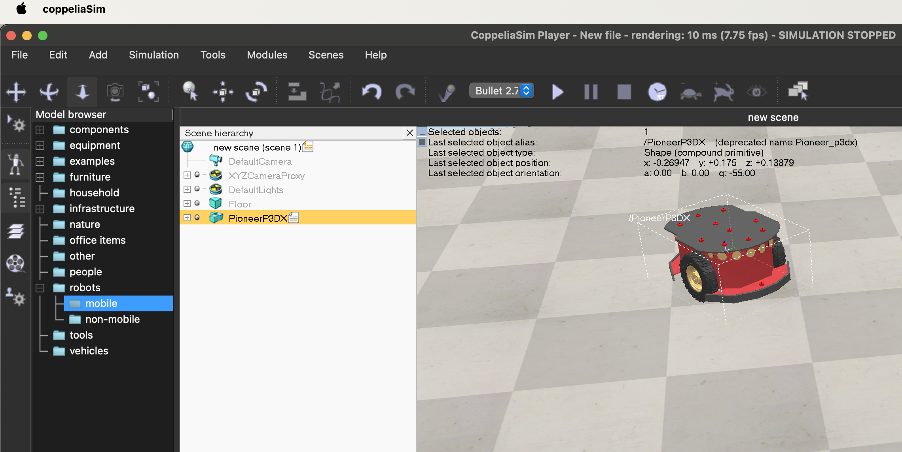
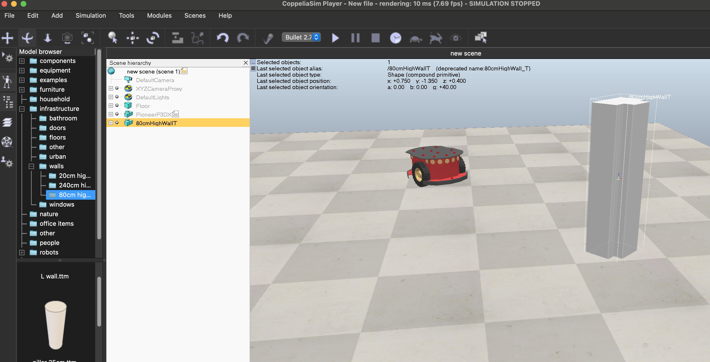
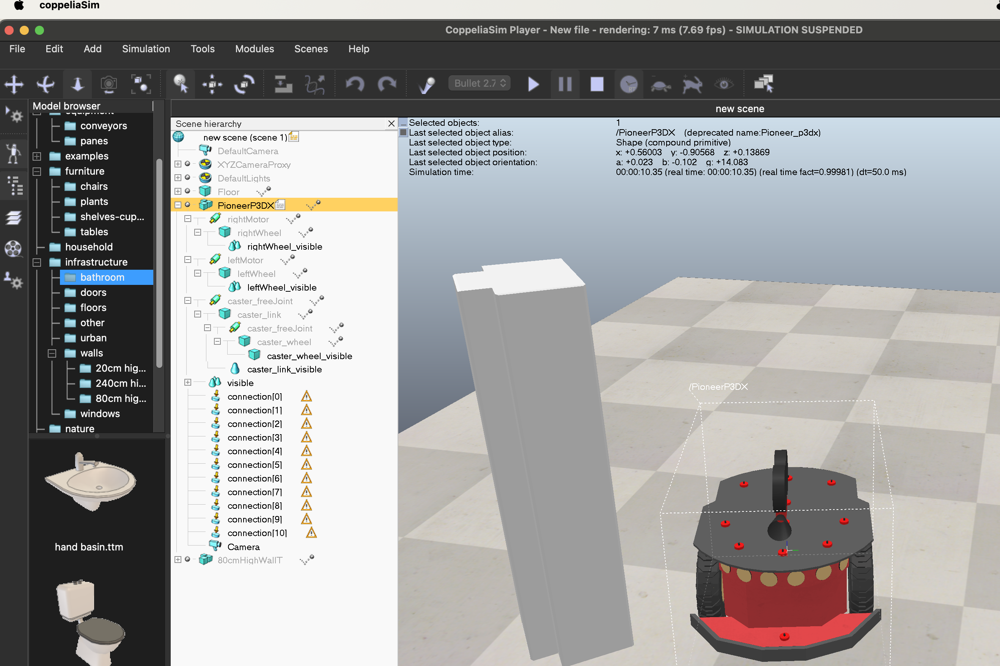
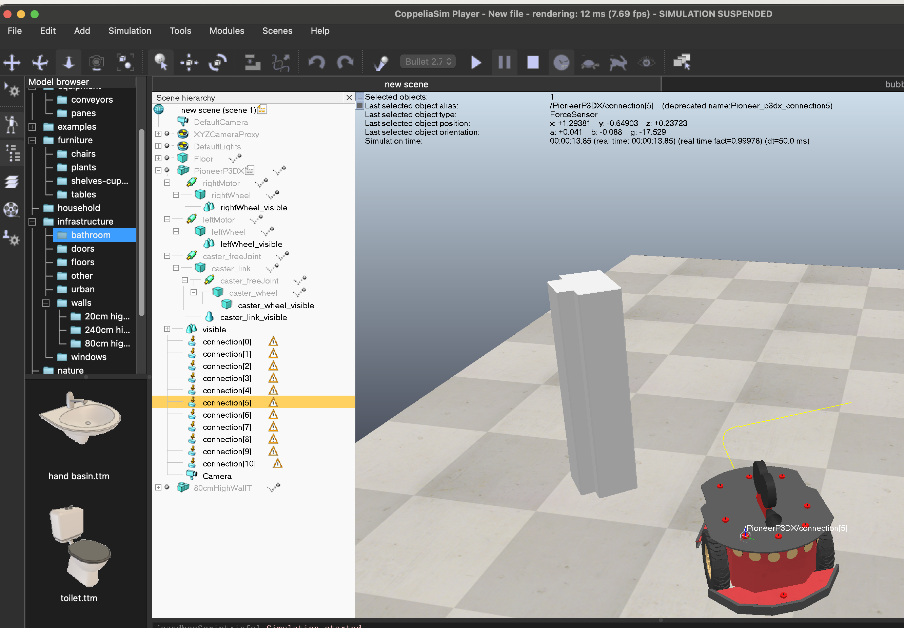
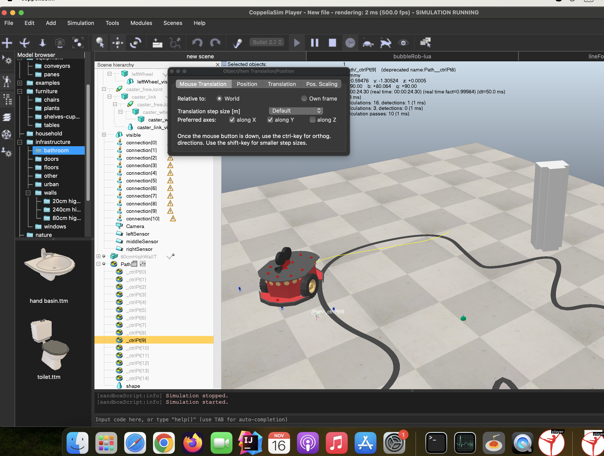

## Комп'ютерні системи імітаційного моделювання
## СПм-22-3, **Привалов Богдан Вікторович**
### Лабораторна робота №**4**. Моделювання у середовищі CoppeliaSim

 

### 4.1 Мета роботи
Ознайомитись із можливостями середовища робототехнічного моделювання CoppeliaSim. Використовувати існуючі моделі та компоненти, отримати навички корегування логіки їхньої роботи. Отримати уявлення про синтакс мови Lua.

 

### 4.2 Необхідні засоби
Для виконання лабораторної роботи знадобиться вільно розповсюджуване (для навчального використання) середовище [**CoppeliaSim**](https://www.coppeliarobotics.com/downloads).  
Процес виконання даної лабораторної роботи (на відміну від попередніх) немає необхідності описувати в md-файлі. Для відпрацювання достатньо буде відповідного **файлу сцени** ("File" -> "Save scene as..." -> "CoppeliaSim scene...") та відповідей на запитання щодо неї.

 

### 4.3 Порядок виконання роботи
1. У новій сцені (що відкривається при запуску CoppeliaSim) **додати робота Pioneer P3DX** (знайти можна в "Model browser" -> "robots" -> "mobile"). *Це вже знайомий з лекцій робот, що рухається двома колесами, швидкість обертання кожного з яких управляється сигналами з датчиків, що дозволяє змінювати напрямок руху при виявленні поблизу перешкоди.*  
   Попрактикуватись у маніпулюванні сценою – запуск симуляції, переміщення об'єктів, обертання об'єктів у різних площинах, зміна кута огляду сцени тощо. *Це стане в нагоді при подальшій роботі.*

2. Додати на сцену у довільне місце перед роботом **перешкоду**. Наприклад, звичайну стіну: "Model browser" -> "infrastructure" -> "walls"). Перевірити, як зміниться напрямок руху робота.

3. Додати на робота **камеру**, зображення з якої виводитиметься користувачеві і буде показуватиме, що "бачить" перед собою робот у процесі руху. Для цього необхідно додати власне камеру (стежте, щоб вона була додана саме до складу робота в ієрхії об'єктів сцени) і, за ПКМ по сцені, додати Floating view (це "екран", що відображається користувачеві), у властивостях якого потрібно асоціювати його з обраною камерою. Перевірити роботу.

4. Додати **трасування** руху робота - щоб він залишав за собою "слід". Зручно для цього скористатися кодом із роботів з готових сцен у папці tutorials, що йде в комплекті з CoppeliaSim.

5. На основі сцени "LineFollowingBubbleRob" (з якої зручно брати елементи та код для своєї сцени), реалізувати переміщення робота Pioneer P3DX **по лінії**. Для цього потрібно додати датчики (з відповідною логікою) та "трасу". *Зверніть увагу на зміну траси - буквальний копіпаст буде поганою ідеєю, т.к. піонер може просто не вписатися за габаритами. Хоча, це можна підправити розміщенням датчиків... До речі, в моєму прикладі роботи датчики розміщені дещо некоректно - частина з них геометрично виявилася трохи попереду корпусу робота.*
    
    
   Можливе ускладнення завдання шляхом використання інших роботів, опанування інших компонентів та логіки їх роботи, неописаних можливостей CoppeliaSim (за своїм інтересом, простір для цього є) - це **припустимо і заохочується** вищими балами за **відпрацювання**.  
   Обов'язково **узгодьте**, що саме плануєте реалізувати з неврахованого порядком виконання роботи. Це дозволить і визначити, наскільки потребує таке ускладнення підвищення оцінки.  
   У разі узгодженого ускладнення, ця "ускладнена" лабораторна робота може виконуватися спільно **колективом** до трьох і більше (за погодженням) осіб. Але пам'ятайте, що питання відпрацювання будуть до всіх учасників бригади.

